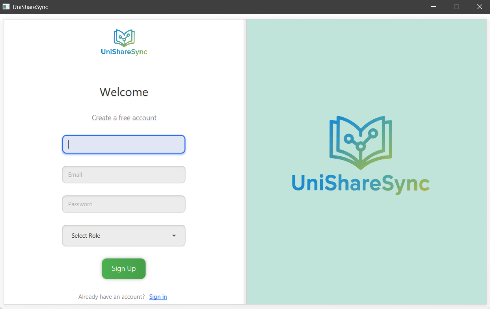
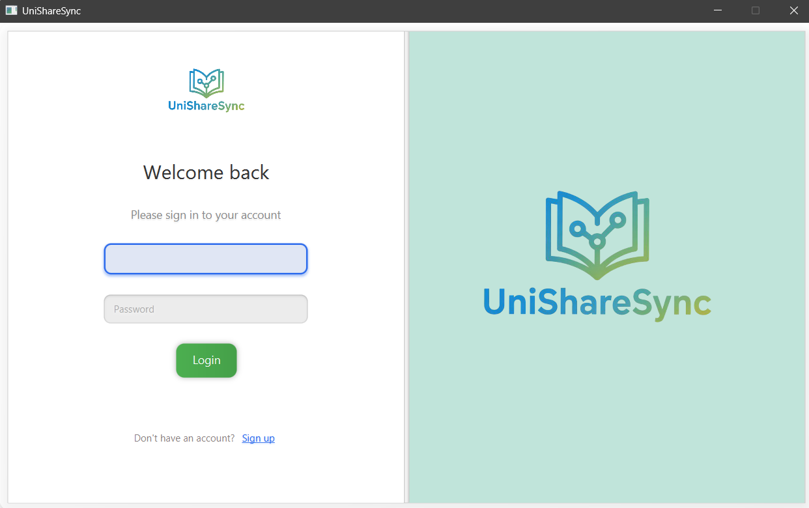
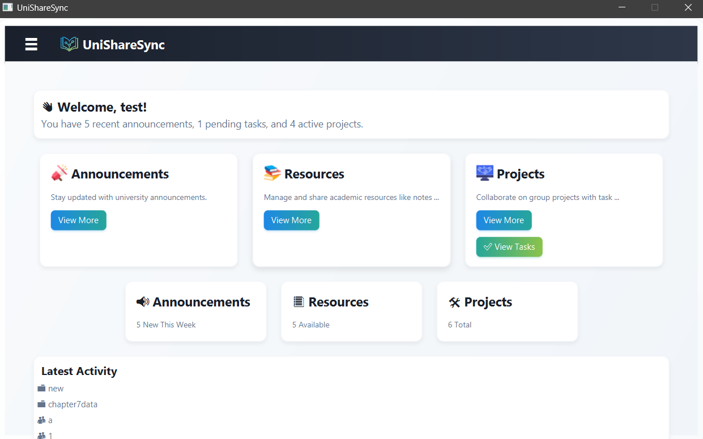
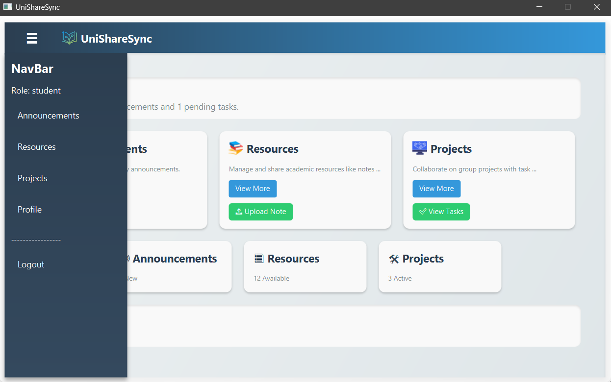
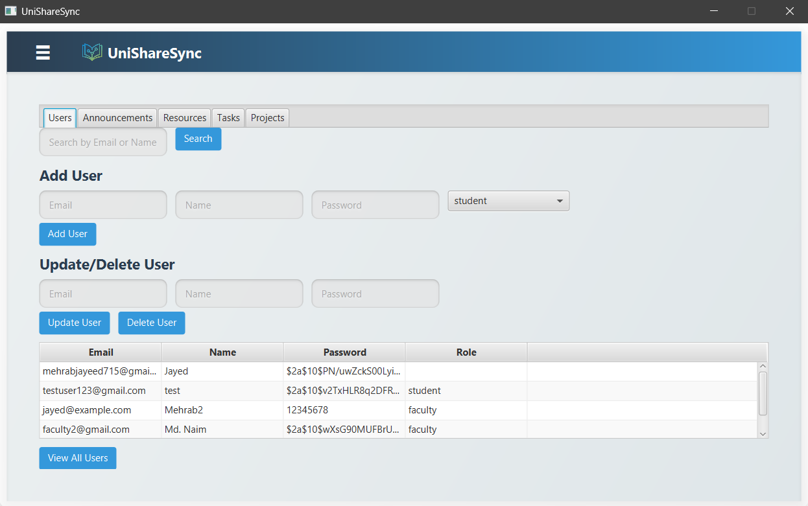
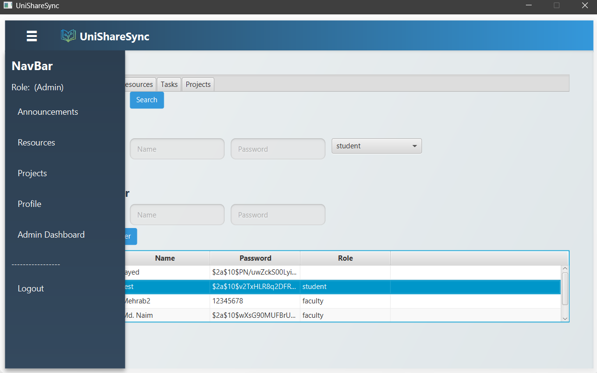

# UniShareSync

**UniShareSync** is a JavaFX-based desktop application that enables efficient resource sharing and collaboration within university environments. It provides dashboards for students, faculty, and administrators, supporting roles-based access, announcements, resources, projects, and task management.

---

## Features

### 1. Signup Page
- Users can register with an email, name, password, and role (student or faculty).
- Role selection determines user type.
- Data is stored in a MySQL database with a `role` column and `is_admin` boolean flag.

### 2. Login Page
- Users log in using their email and password.
- Authenticates and redirects based on role.
- Displays error messages for invalid credentials.

### 3. Dashboard
- User-friendly interface with a collapsible sidebar.
- Role-based views with navigation to Announcements, Resources, Projects, and Profile.
- Each section supports searchable tables and CRUD operations.

### 4. Navbar
- Navigation menu includes: Announcements, Resources, Projects, Profile, and Logout.
- Dynamically adjusts visibility based on the user's role.

### 5. Admin Dashboard
- Available only to admin users.
- Management capabilities:
  - **User Management**: CRUD for student/faculty users.
  - **Resource Management**: Upload and manage academic files.
  - **Announcement Management**: Create and manage announcements.
  - **Task Management**: Assign and track tasks.
  - **Project Management**: Add, edit, or remove project records.
- Separate tables display data with appropriate columns.

### 6. Admin Navbar
- Extends the standard navbar with an **Admin Dashboard** button.
- Offers access to all standard features with added admin control.

---

##  Screenshots

### Signup Page  

### Login Page  

### Dashboard  
  

### Admin Dashboard  

### Admin Navbar  

---

